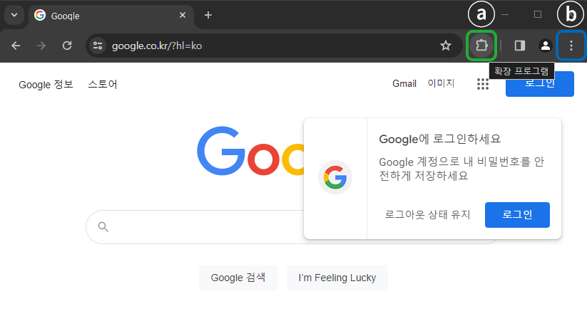
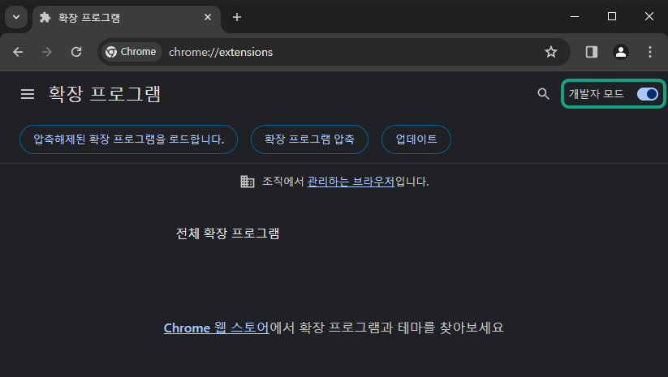
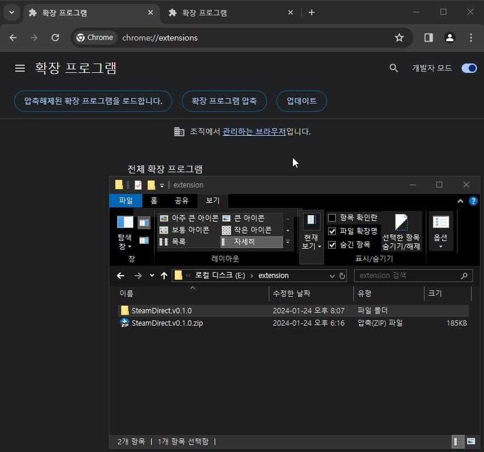
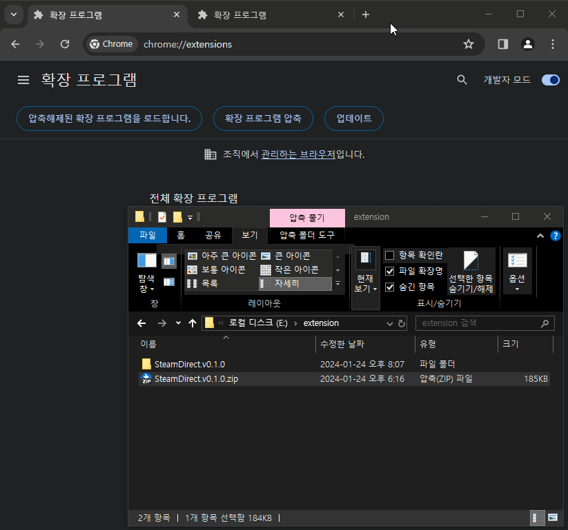
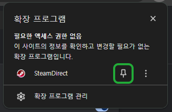

# 수동 설치 가이드

본 문서에서는 SteamDirect 확장 프로그램의 수동 설치 방법을 단계별로 설명합니다. 
이 방법은 복잡할 수 있으며, 대부분의 사용자에게 권장되지 않습니다. 가능하다면 [자동 설치](README.md#다운로드)를 사용해주세요.

## 목차
1. [다운로드](#1-다운로드) 
2. [확장 프로그램 페이지 이동](#확장-프로그램-페이지-이동) 
3. [개발자 모드 활성화](#개발자-모드-활성화) 
4. [압축 해제된 확장 프로그램 로드](#압축-해제된-확장-프로그램-로드) 
5. [확장 프로그램 고정하기](#확장-프로그램-고정하기) 
6. [설치 완료](#3-설치-완료) 

## 다운로드
아래 버튼을 눌러 다운로드 해주세요.

## 확장 프로그램 페이지 이동 
두가지의 방법중 편한 방법을 선택해주세요. 

1. **주소창을 통한 접근**: 브라우저의 주소창에 `chrome://extensions/`를 입력니다. 이 방법은 모든 지원되는 브라우저에서 동일하게 작동합니다.
 

2. **브라우저 메뉴를 통한 접근**:

- a. 확장 프로그램 아이콘을 클릭하고 `확장프로그램 관리`를 선택합니다.

- b. 더보기 아이콘을 클릭하고 `확장 프로그램` > `확장프로그램 관리`를 선택합니다. 
 

## 개발자 모드 활성화 

 
확장 프로그램 페이지의 우측 상단에서 '개발자 모드'토글 스위치를 클릭하여 활성화합니다. 

## 3. 압축 해제된 확장 프로그램 로드 
압축 해제된 확장 프로그램을 로드하는 두 가지 방법 중 하나를 선택하세요: 

### 1. 드래그 앤 드롭을 통한 설치
확장 프로그램 파일을 브라우저의 확장 프로그램 페이지로 드래그하여 설치합니다. 

 
 

### 2. 파일 선택을 통한 설치
`압축해제된 확장프로그램을 로드합니다.` 버튼을 클릭한 후 파일 선택 창에서 압축을 푼 폴더를 선택합니다. 폴더 내부의 파일이 아닌 폴더 자체를 선택해야 합니다. 
 

## 4. 확장 프로그램 고정
1. 확장 프로그램 아이콘을 클릭한 후, SteamDirect를 찾아 `고정` 버튼을 클릭합니다. 
 

2. 또는 확장 프로그램 페이지에서 SteamDirect의 세부정보를 클릭한 후 툴바에 고정을 선택합니다. 

## 5. 설치 완료
이제 설치가 완료되었습니다. SteamDirect 사용 방법에 대한 자세한 정보는 README.MD의 [사용법](README.md#사용법)을 참고해주세요. 