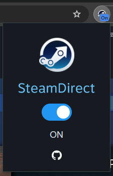
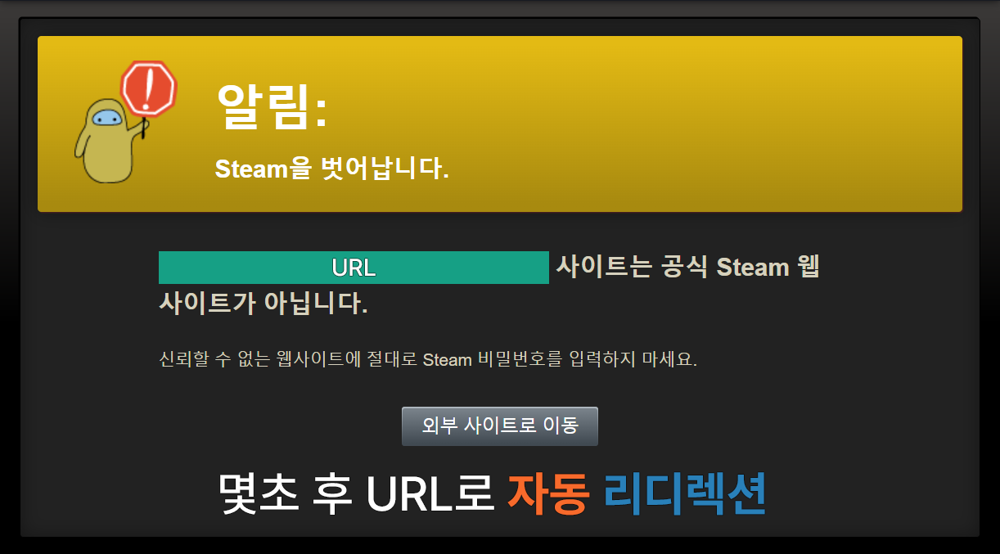
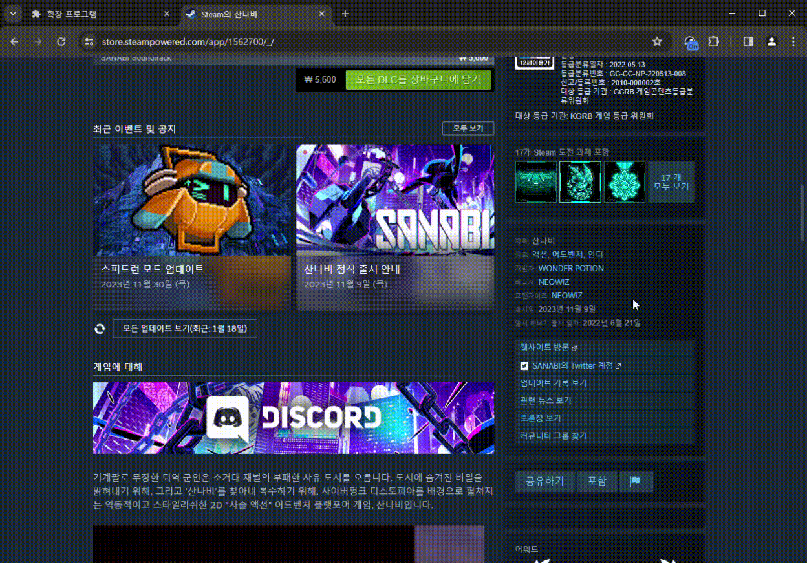
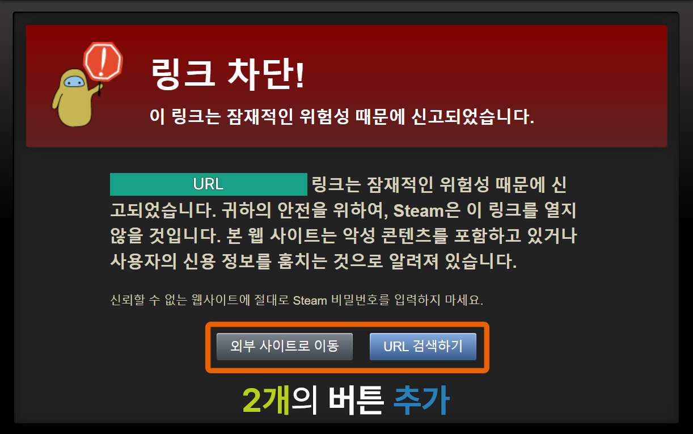
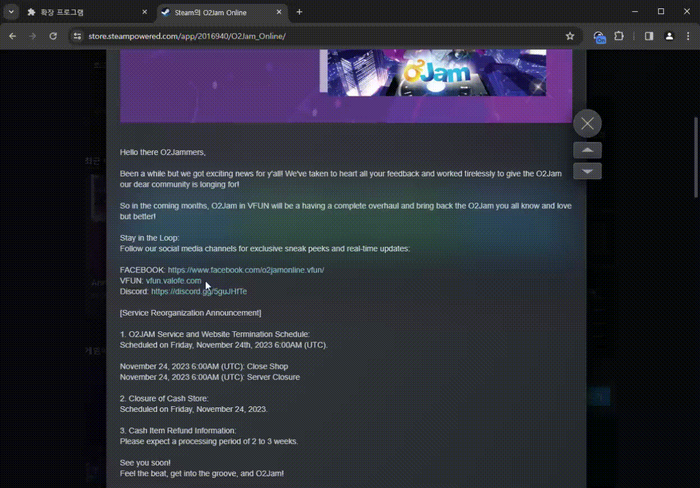

# SteamDirect
```
이 프로젝트는 제 첫 js 프로젝트입니다.
배포보단 공부목적으로 올린 Repo로 코드가 난잡하고, 개선할 점이 많습니다.
issues나 pull request로 피드백을 주시면 감사하겠습니다.
```

<p align="center">

</p>

</br>

<p align="center">
    <a href="https://chromewebstore.google.com/detail/cpipnadbkplegpnjcpedodfgcicgninh" target="_blank">
    <picture>
      <source srcset="https://i.imgur.com/XBIE9pk.png" media="(prefers-color-scheme: dark)">
      </picture></a>
    </a>
</p>

---

[소개](#소개)</br>
[지원 사이트](#지원-사이트)</br>
[다운로드](#다운로드)
[사용법](#사용법)</br>
[개인정보 처리방침](#개인정보-처리방침)</br>
[면책 조항](#면책-조항)</br>
[작동 원리](#작동-원리)</br>


## 소개

SteamDirect는 [Steam]의 리다이렉트 경고창을 건너뛰는 브라우저 확장프로그램 입니다.</br>
Steam에서 링크를 누르면 리다이렉트 경고창이 뜨는데, 이를 무시하고 바로 사이트로 이동할 수 있습니다.


## 지원 사이트

SteamDirect는 Steam 서비스(Steam store, Community, Steam Chat)에서 활성화됩니다.</br>
확장프로그램 아이콘 색깔로 동작 여부를 확인할 수 있습니다.</br>


| </a> | </a> |
| :---: | :---: |
|활성화| 비활성화 |


### 활성화(파란색)
Steam 서비스(Steam store, Community, Steam Chat) 접속시 파란색 아이콘이 표시됩니다.</br>

### 비활성화(붉은색)
그 외의 사이트 접속시 붉은색 아이콘이 표시됩니다.</br>

## 다운로드
[Chrome Web Store]를 통해 확장프로그램을 다운 받을 수 있습니다.(최상단 이미지 클릭)</br>
### 지원 브라우저
Manifest v3를 지원하는 Chromium 기반 브라우저 (Chrome, Edge, Whale, Opera, Vivaldi 등)에서 사용 가능합니다.

<details>
<summary>수동설치를 원하는 경우</summary>

> 이 방법은 복잡할 수 있으며, 대부분의 사용자에게 권장되지 않습니다. 가능하다면 [Chrome Web Store]를 통해 다운로드 해주세요.</br>

#### 설치시, [수동 설치 가이드](Manual_install_guide.md) 문서를 참조해 주세요.</br>

### 1. 다운로드
아래 버튼을 눌러 다운로드 해주세요.

[](https://github.com/L4N14KE4/SteamDirect/releases/download/v.1.0.0/SteamDirect_v1.0.0.zip)

혹은 [Releases]에서 `SteamDirect v1.0.0.zip`을 다운받아 설치합니다.</br>


### 2. 설치
다운로드한 파일의 압축을 풀고, 브라우저의 확장 프로그램 페이지에서 `개발자 모드`를 활성화한 후, `압축 해제된 확장 프로그램을 로드합니다`를 클릭하여 설치합니다.
</details>

## 사용법
> 사용전 SteamDirect를 [툴바에 고정](Manual_install_guide.md#5-확장-프로그램-고정)해주세요.</br>


</br>

SteamDirect 확장 프로그램 아이콘을 클릭하여 `ON / OFF` 토글로 활성화 상태를 조절할 수 있습니다. 기본값은 `ON`입니다.

Steam 리다이렉트 경고창은 `알림`과 `링크 차단!` 두 가지가 있으며 각각 노란색과, 빨간색으로 표시됩니다.

### 1. 알림(Notice)

SteamDirect가 `ON`인 경우 SteamDirect가 자동으로 해당 알림창을 건너뜁니다.</br>
해당창은 몇초 내로 자동으로 사라지고, 리디렉트 URL로 이동합니다.</br>


</br>
</br>

---
### 2. 링크차단(Link Blocked!)

해당 경고의 경우 사용자의 판단에 맡깁니다.</br>
`외부창으로 이동`, `URL 검색하기` 버튼을 통해 사이트로 이동할지, [urlscan.io] 검색창으로 이동할지 선택할 수 있습니다.</br>


</br>
</br>


## 개인정보 처리방침
SteamDirect는 사용자의 개인정보를 수집하거나 저장하지 않습니다. 이 확장 기능은 오로지 https://steamcommunity.com/* 형태의 URL에 대해서만 작동합니다.


## 면책 조항
### 1. 보안 위험 통지

### 중요: SteamDirect 확장 프로그램 사용으로 인해 발생하는 모든 보안 문제 및 데이터 손실에 대한 책임은 사용자 본인에게 있습니다.

Steam에서는 사용자의 안전을 위해 리다이렉트 경고창을 띄우고 있습니다. 이 확장프로그램은 해당 경고창을 건너뛰는 기능을 수행합니다. 이는 피싱 사이트나 악성 소프트웨어가 포함된 웹사이트로의 접근 위험을 증가시킬 수 있습니다.</br>
사용자는 이 확장 프로그램을 사용함으로써 발생할 수 있는 모든 보안 위험을 인지하고, 이에 대한 전적인 책임을 지게 됩니다.


### 2. URL 검색 기능([urlscan.io])에 대한 주의
`URL 검색하기` 기능은 제공되는 링크의 안전성을 평가하는 데 도움을 줄 수 있지만, 이 기능은 완벽하지 않으며 모든 위험을 예측하거나 방지할 수 없습니다.
</br>사용자는 외부 링크로 이동하기 전에 해당 링크의 안전성을 스스로 판단해야 합니다.


### 3. 상표 및 로고 사용에 대한 명시
SteamDirect는 Valve Corporation의 [Steam] 서비스와 관련이 없으며, Valve Corporation이나 [urlscan.io]의 공식적인 승인이나 지원을 받지 않습니다.</br>
[Steam]과 [urlscan.io]는 각각 해당 회사의 상표이며, 이 프로젝트에서 사용된 모든 로고나 상표는 식별 목적으로만 사용됩니다.


## 작동 원리

**백그라운드 스크립트(`service_worker`)**: `background.js`가 실행되면서 현재 페이지가 Steam 사이트인지 판단하고, 그에 따라 확장 프로그램 아이콘의 색상을 변경합니다. 스위치 버튼의 상태에 따라 아이콘에 `ON/OFF`를 표시합니다.

**팝업**: 확장 프로그램 아이콘을 클릭하면 팝업 페이지(`popup.html`)가 뜹니다. 팝업 페이지에는 `popup.js` 스크립트가 포함되어 있어, 스위치 버튼의 상태를 관리합니다. 기본 상태는 활성화 상태입니다.

**콘텐츠 스크립트 실행**: `https://steamcommunity.com/linkfilter/*`에 매칭되는 페이지에서 콘텐츠 스크립트인 `steam.js`가 작동합니다. 이 스크립트는 웹 페이지가 로딩된 후에 실행됩니다.

1. 확장 프로그램 활성화 여부 확인: `steam.js` 스크립트는 확장 프로그램이 활성화된 상태인지 확인합니다.

2. 리디렉션 수행

#### 경고 메시지에 따른 동작 차이</br>
`steam.js` 스크립트는 linkfilter 페이지의 경고 메시지의 유무에 따라 다르게 동작합니다.</br>
경고가 없는 경우(알림): 경고 메시지가 없는 경우, URL 파라미터 'u'에 포함된 URL로 리디렉션을 수행합니다.

링크 차단 경고: h1 태그에 '링크 차단!' 또는 'Link Blocked!' 경고 메시지가 있는 경우, 링크 차단 경고가 감지되었다는 로그를 출력합니다.</br>
이 경우, URL 파라미터 'u'에 포함된 URL로 이동하는 것을 막고, `외부 사이트로 이동`과 `URL 검색하기` 버튼을 생성합니다.


[steam]: https://store.steampowered.com/ "Steam"
[urlscan.io]: https://urlscan.io/ "urlscan.io"
[Releases]: https://github.com/L4N14KE4/SteamDirect/releases/tag/v.1.0.0 "Releases"
[Chrome Web Store]: https://chrome.google.com/webstore/detail/steamdirect/cpipnadbkplegpnjcpedodfgcicgninh "Chrome Web Store"