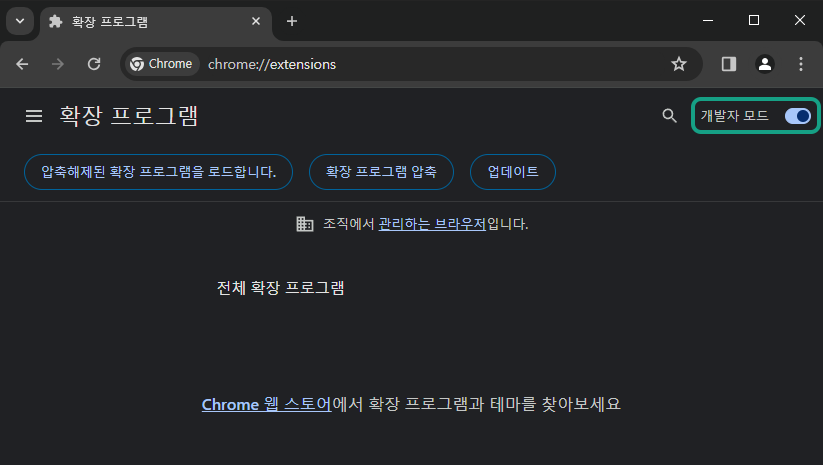
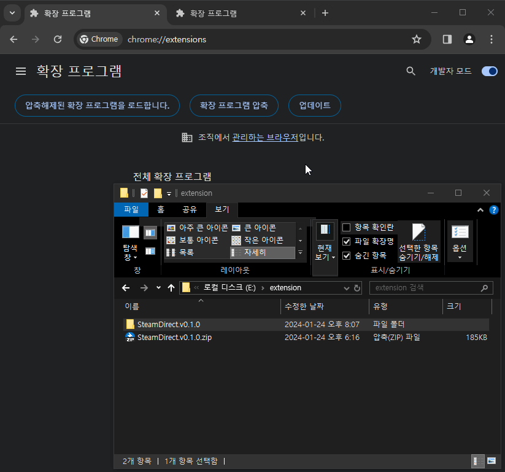
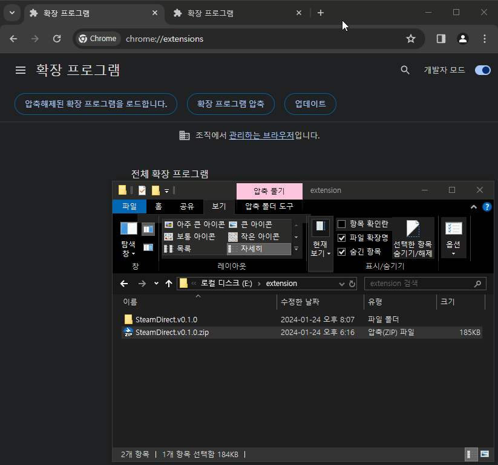

# 설치 가이드

이 문서에서는 SteamDirect를 설치하는 방법을 설명합니다.

[다운로드](#1-다운로드) 
[1.확장프로그램 페이지 이동](#1-확장프로그램-페이지-이동) 
[2. 개발자 모드 활성화](#2-개발자-모드-활성화) 
[3. 압축해제된 확장프로그램 불러오기](#3-압축해제된-확장프로그램-불러오기) 
[4. 확장프로그램 고정하기](#4-확장프로그램-고정하기) 
[설치 완료](#3-설치-완료) 

## 다운로드
아래 버튼을 눌러 다운로드 해주세요.

## 1. 확장프로그램 페이지 이동 
두가지의 방법중 편한 방법을 선택해주세요. 

1. 브라우저의 주소창에 `chrome://extensions/`를 입력 
브라우저에 관계없이 확장프로그램 페이지로 이동합니다. 
 

2. 브라우저의 확장 아이콘이나 더보기에서 `확장 프로그램`을 클릭

- a.  확장 아이콘 눌러 이동 
`확장프로그램 아이콘` 클릭 > `확장프로그램 관리`

- b.  더보기 눌러 이동 
점 세개 클릭 > `확장 프로그램` > `확장프로그램 관리`를 클릭 

 

## 2. 개발자 모드 활성화 
 
우측 상단의 `개발자 모드` 버튼을 눌러 활성화 합니다. 

## 3. 압축해제된 확장프로그램 불러오기 
두가지의 방법중 편한 방법을 선택해주세요. 

### 1. `드래그 앤 드롭` 하여 설치 
파일을 브라우저의 확장프로그램 페이지로 드래그하여 설치합니다. 

 
 

### 2. 파일 선택하여 설치 
`압축해제된 확장프로그램을 로드합니다.` 버튼을 눌러 설치합니다. 
파일 선택 창이 뜨면, 압축을 푼 폴더를 선택합니다. 
중요한 점은 폴더를 선택해야 합니다. 폴더 내부의 파일을 선택하면 안됩니다. 
 

## 4. 확장프로그램 고정하기
확장프로그램 아이콘을 눌러 나오는 확장 중 SteamDirect를 `고정` 버튼을 눌러주세요. 
 

혹은 확장프로그램 페이지에서 SteamDirect의 `세부정보`를 눌러 `툴바에 고정` 버튼을 눌러주세요. 

## 5. 설치 완료
설치가 완료되었습니다. 
나머지는 README.MD의 [사용법](README.md#사용법)을 참고해주세요. 